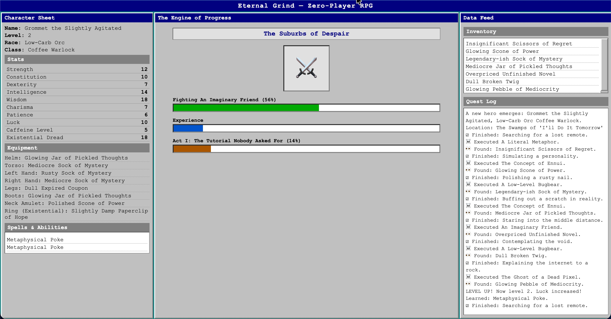

# Eternal Grind

## Experience _Eternal Grind_ now!

**Experience it now! Point your browser [here](https://accordionguy.github.io/eternal-grind/),** then sit back and enjoy the adventure as the game plays itself for you. No effort required, and no time lost to the grind that other online role-playing games bring.

## What’s Eternal Grind all about?

*Eternal Grind* is my agentically-coded homage to the 2000s classic Windows game, [*Progress Quest*](https://en.wikipedia.org/wiki/Progress_Quest), which in turn was a parody of the then-popular [*EverQuest*](https://en.wikipedia.org/wiki/EverQuest).

Like *Progress Quest*, it aims to be the ultimate “zero-player” RPG experience, providing all the dopamine of a legendary quest, but with absolutely none of the effort.

In the spirit of today’s best workflows, *Eternal Grind* automates the entire heroic journey, from slaying fantastical creatures like Literal Metaphors to hoarding  fabulous artifacts such as the Scissors of Regret.

The game automatically creates characters like Kevin from Accounting (a Low-Carb Orc and Spreadsheet Warrior by trade), after which your only job is to sit back and watch the progress bars fill. It’s a witty, Windows XP styled commentary on the nature of the “grind,” where the numbers always go up, the loot is perpetually absurd, and your lack of agency is the greatest feature of all.

## How to install _Eternal Grind_

Eternal Grind is a self-contained web application, so all you need to do to run it on your own server or local machine is to copy the following files to a directory...

- [`game.js`](https://github.com/AccordionGuy/eternal-grind/blob/main/game.js)
- [`index.html`](https://github.com/AccordionGuy/eternal-grind/blob/main/index.html)
- [`style.css`](https://github.com/AccordionGuy/eternal-grind/blob/main/style.css)

...and then open `index.html` in your browser.

## How was _Eternal Grind_ made?

I developed _Eternal Grind_ agentically, using Zencoder’s Zenflow tool, starting with a spec and then refining it through a back-and-forth with Zenflow’s coding and review agents.

I inlcuded the original spec in this repo’s `docs` directory — it’s the `Eternal Grind spec.md` file.
